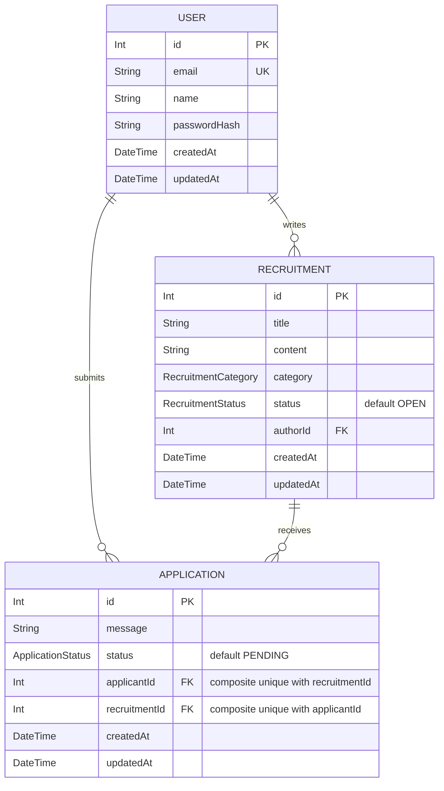

# 14차시 — 데이터베이스 기초와 Campus Crew ERD

이번 차시의 목표는 **User, Recruitment, Application에 어떤 데이터를 저장하고 서로 어떻게 연결할지 설계하는 것**이다. ERD(Entity Relationship Diagram)는 엔티티와 관계를 그린 설계도다. 이 문서는 다음 Prisma schema의 청사진이며, 아직 DB에 테이블이나 제약을 만든 상태는 아니다.

## 1. 메모리 배열에서 데이터베이스로

[13차시](./session-13-checkpoint.md)의 `RecruitmentsService`는 모집글을 메모리 배열에 보관한다. POST로 추가한 데이터는 서버 프로세스가 종료되면 사라지고, 재시작하면 코드에 적힌 초기 모집글 3개와 다음 id 4로 돌아간다.

일반적인 영속 DB는 데이터를 디스크 등 지속되는 저장소에 기록한다. 저장이 완료된 데이터는 애플리케이션 서버를 재시작해도 다시 조회할 수 있다. 이것이 **영속성(persistence)**이다. 다만 DB 데이터를 직접 삭제하거나 저장소를 제거하면 사라질 수 있으므로, 영속성이 백업을 대신하지는 않는다.

| 개념          | 의미                           | Campus Crew 예시              |
| ------------- | ------------------------------ | ----------------------------- |
| Table(테이블) | 같은 종류의 데이터를 모은 구조 | 모집글을 저장하는 Recruitment |
| Row(행)       | 한 건의 데이터                 | React 스터디 모집글 한 건     |
| Column(열)    | 각 행이 가지는 속성            | id, title, status             |

아래는 Recruitment 테이블의 일부 열만 뽑은 **미래 DB 예시**다. 현재 메모리 배열에 authorId가 구현되었다는 뜻은 아니다.

| id  | title              | authorId | status |
| --- | ------------------ | -------- | ------ |
| 10  | React 스터디       | 1        | OPEN   |
| 11  | 캠퍼스 앱 프로젝트 | 1        | CLOSED |

## 2. PK, FK와 1:N 관계

- **PK(Primary Key, 기본 키):** 한 테이블에서 행 하나를 유일하게 식별한다. 세 엔티티 모두 `id`를 PK로 갖는다. 같은 테이블 안에서 중복되거나 비어 있을 수 없다. 이름이나 제목이 같아도 id로 구별한다.
- **FK(Foreign Key, 외래 키):** 다른 테이블의 행을 참조해 관계를 연결한다. `Recruitment.authorId`는 `User.id`를 가리킨다. FK 제약을 구현하면 존재하지 않는 User의 id를 작성자로 저장할 수 없다.
- **1:N(일대다):** 한 사용자는 여러 모집글을 작성할 수 있지만, 모집글 한 건의 작성자는 정확히 한 명이다. 이 설계에서 N 쪽은 0건도 허용한다. 아직 글이나 지원이 없는 사용자도 존재한다.

위 예시의 두 모집글은 모두 id 1인 User가 작성했다. 이름을 각 모집글에 복사하는 대신 authorId로 같은 사용자를 참조한다. FK는 **여러 건이 있는 쪽(N)**에 둔다.

## 3. 핵심 엔티티와 필드

아래 타입은 다음 Prisma 차시와 맞추기 위한 설계 방향이다. 기존 API의 숫자 id에 맞춰 id와 FK를 `Int`로 표현하며, 구체적인 id 생성 방식은 schema 구현 시 정한다. 모든 필드는 필수 값으로 설계한다. `createdAt`은 생성 시각, `updatedAt`은 마지막 수정 시각이며, 생성 시 두 값을 기록하고 수정 시 updatedAt을 갱신하는 방향이다. 자동 기록은 다음 차시에서 구현한다.

### User — 사용자

모집글 작성자와 지원자는 서로 다른 종류의 사용자가 아니라, 같은 User가 관계에 따라 맡는 역할이다.

| 필드         | 타입 방향 | 역할 / 제약                                            |
| ------------ | --------- | ------------------------------------------------------ |
| id           | Int       | PK, 사용자 식별자                                      |
| email        | String    | 이메일, unique로 중복 방지                             |
| name         | String    | 사용자 표시 이름; 이름이 같을 수 있음                  |
| passwordHash | String    | 비밀번호 원문이 아닌 해시 값; 인증 구현은 이번 범위 밖 |
| createdAt    | DateTime  | 사용자 생성 시각                                       |
| updatedAt    | DateTime  | 사용자 정보 최종 수정 시각                             |

### Recruitment — 모집글

| 필드      | 타입 방향           | 역할 / 제약                       |
| --------- | ------------------- | --------------------------------- |
| id        | Int                 | PK, 모집글 식별자                 |
| title     | String              | 모집글 제목                       |
| content   | String              | 모집 내용                         |
| category  | RecruitmentCategory | STUDY / PROJECT / CONTEST 중 하나 |
| status    | RecruitmentStatus   | 모집 상태, 기본값 OPEN            |
| authorId  | Int                 | FK → User.id, 작성자              |
| createdAt | DateTime            | 모집글 생성 시각                  |
| updatedAt | DateTime            | 모집글 최종 수정 시각             |

### Application — 지원 기록

| 필드          | 타입 방향         | 역할 / 제약                            |
| ------------- | ----------------- | -------------------------------------- |
| id            | Int               | PK, 지원 한 건의 식별자                |
| message       | String            | 해당 모집글에 보내는 지원 메시지       |
| status        | ApplicationStatus | 지원 처리 상태, 기본값 PENDING         |
| applicantId   | Int               | FK → User.id, 지원자                   |
| recruitmentId | Int               | FK → Recruitment.id, 지원 대상 모집글  |
| createdAt     | DateTime          | 지원한 시각                            |
| updatedAt     | DateTime          | 메시지나 상태를 마지막으로 수정한 시각 |

추가 제약은 **`unique(applicantId, recruitmentId)`**다. 두 필드를 묶은 조합이 유일해야 하며, 각 FK가 혼자서 유일해야 한다는 뜻은 아니다.

## 4. Enum — 허용하는 값의 목록

| Enum                | 값                          | 의미 / 기본값                           |
| ------------------- | --------------------------- | --------------------------------------- |
| RecruitmentCategory | STUDY, PROJECT, CONTEST     | 스터디, 프로젝트, 공모전; 입력으로 선택 |
| RecruitmentStatus   | OPEN, CLOSED                | 모집 중, 모집 마감; 기본값 OPEN         |
| ApplicationStatus   | PENDING, APPROVED, REJECTED | 검토 대기, 승인, 거절; 기본값 PENDING   |

자유로운 문자열은 `OPEN`, `open`, `모집중`처럼 같은 의미를 다르게 저장하기 쉽다. enum은 허용 값을 정해 오타와 상태 표현의 불일치를 줄인다. 기본값은 값을 생략할 때 사용할 값이며, 허용하지 않는 입력을 자동으로 올바른 값으로 고친다는 뜻은 아니다.

현재 TypeScript 타입과 Swagger 설명만으로 런타임 입력이 검증되지는 않는다. 이 표의 DB 제약과 향후 요청 검증을 실제로 적용하는 작업은 이후 차시에서 진행한다.

## 5. Mermaid ERD

도표의 대문자 이름은 각각 User, Recruitment, Application을 나타낸다. `||`는 정확히 1개, `o{`는 0개 이상이다. `PK`는 기본 키, `FK`는 외래 키, `UK`는 unique 키다. Application의 두 FK는 각각 단독 UK가 아니며, **조합에 대한 unique**를 주석과 본문으로 표시했다. 이 도표의 선 자체가 DB 제약을 생성하지는 않는다.

| 관계                        | 읽는 법                                                                       | FK 위치                                    |
| --------------------------- | ----------------------------------------------------------------------------- | ------------------------------------------ |
| User 1:N Recruitment        | 사용자 한 명은 모집글 0개 이상을 작성하고, 각 모집글은 작성자 한 명을 갖는다. | Recruitment.authorId → User.id             |
| User 1:N Application        | 사용자 한 명은 지원 0건 이상을 제출하고, 각 지원은 지원자 한 명을 갖는다.     | Application.applicantId → User.id          |
| Recruitment 1:N Application | 모집글 하나는 지원 0건 이상을 받고, 각 지원은 모집글 하나를 대상으로 한다.    | Application.recruitmentId → Recruitment.id |

Mermaid 문법과 기호는 [공식 ERD 문서](https://mermaid.js.org/syntax/entityRelationshipDiagram.html)를 참고한다.

## 6. Application이 독립 엔티티인 이유

사용자는 여러 모집글에 지원할 수 있고, 모집글은 여러 사용자의 지원을 받을 수 있다. 이 지원 관계만 보면 User와 Recruitment는 N:M(다대다)이지만, Application을 두면 **User 1:N Application과 Recruitment 1:N Application**으로 풀어낼 수 있다. 작성자 관계인 User 1:N Recruitment는 이와 별개의 관계다.

Application은 두 id만 연결하는 단순 중간 테이블을 넘어 **지원 한 건의 의미와 처리 과정**을 저장하는 독립 엔티티다. 같은 사용자가 React 스터디와 공모전에 지원해도 메시지, 처리 상태, 지원 시각이 다를 수 있다. 따라서 `message`, `status`, `createdAt`, `updatedAt`은 User나 Recruitment가 아닌 Application의 속성이다. 자체 PK인 id로 특정 지원 한 건을 식별한다. 여기서 독립 엔티티란 자체 식별자와 업무 속성을 갖는다는 뜻이며, 참조 대상 없이 존재할 수 있다는 뜻은 아니다.

예를 들어 id 2인 사용자가 id 10인 모집글에 지원하면 Application에는 `applicantId=2`, `recruitmentId=10`, 지원 메시지, `PENDING`과 시각을 저장한다. 추후 승인 처리에서는 같은 지원 행의 상태를 `APPROVED`로 바꾸고 updatedAt을 갱신할 수 있다. 상태 변경 API는 이번에 구현하지 않는다.

## 7. 중복 지원 방지와 삭제 정책

### 복합 unique: 한 사용자는 한 모집글에 한 번 지원

Application에 `(applicantId=2, recruitmentId=10)`이 이미 있을 때:

| 새 지원 조합 | 허용 여부 | 이유                                  |
| ------------ | --------- | ------------------------------------- |
| (2, 10)      | 거절      | 같은 사용자가 같은 모집글에 중복 지원 |
| (2, 11)      | 허용      | 같은 사용자가 다른 모집글에 지원      |
| (3, 10)      | 허용      | 다른 사용자가 같은 모집글에 지원      |

Application의 id가 달라도 두 FK의 조합이 같으면 거절해야 한다. applicantId에 단독 unique를 걸면 사용자당 전체 지원이 한 건으로 제한되고, recruitmentId에 단독 unique를 걸면 모집글당 지원이 한 건으로 제한되어 의도한 1:N 관계가 깨진다.

화면에서 버튼을 막거나 서버에서 먼저 조회하는 것만으로는 동시에 들어온 요청이 둘 다 중복 확인을 통과할 수 있다. 이후 DB에 복합 unique 제약을 구현하면 같은 조합의 두 행이 저장되는 것을 막을 수 있다. 이 설계에서는 REJECTED 상태의 행도 조합을 차지하므로, 같은 모집글에 새 지원 행을 만드는 재지원은 허용하지 않는다. 재지원 정책을 바꾸려면 별도 설계가 필요하다.

### 모집글 삭제 시 Application cascade를 고려하는 이유

지원은 대상 모집글이 있어야 의미가 있다. Recruitment를 **실제로 삭제**할 때 관련 Application도 함께 삭제하는 cascade를 고려하면, 존재하지 않는 모집글을 가리키는 지원을 남기지 않고 FK 참조 무결성을 유지할 수 있다. 향후 Application의 recruitment 관계에 적용할 삭제 정책이며, User나 다른 모집글까지 삭제한다는 뜻은 아니다.

다만 cascade는 지원 메시지와 처리 이력도 없앤다. 이력을 보존해야 한다면 삭제를 제한하거나 모집글을 남기는 정책이 필요하다. **`status=CLOSED`로 마감하는 것은 삭제가 아니므로 지원 기록이 그대로 남는다.** 이번에는 이 차이와 cascade 후보 정책을 설계하고, 실제 삭제 기능이나 DB 동작은 구현하지 않는다. User 삭제 시 작성글과 지원을 어떻게 처리할지는 별도 정책으로 결정하며 여기서 자동 cascade로 정하지 않는다.

## 8. 다음 Prisma 차시로 연결

현재 흐름은 `Swagger/Postman → Controller → Service → 메모리 배열`이다. 향후 저장 부분을 `Service → Prisma → DB`로 연결한다. 프론트엔드 Mock UI도 현재 그대로이며, 이번 문서가 API 연결이나 영속화를 실행하지는 않는다.

다음 차시에는 이 문서의 엔티티를 Prisma model로, 필드와 타입을 schema의 필드로 옮긴다. PK, email unique, 세 FK와 관계, Application의 복합 unique, 세 enum과 상태 기본값을 대응시킨다. createdAt/updatedAt 기록 방식과 삭제 정책도 함께 명시한다. Prisma의 관계 필드는 연결된 객체를 탐색하기 위한 표현이고, authorId/applicantId/recruitmentId는 실제 참조 id를 저장하는 필드라는 차이를 이어서 배운다.

이번 차시에는 PostgreSQL 설치/실행, Docker Compose, DBeaver, Prisma 설치/schema 작성/migration, 실제 SQL CREATE TABLE, auth 구현을 하지 않는다.

### 학생 확인 질문

1. POST로 만든 모집글은 서버 재시작 후 왜 사라지는가? DB 영속성과 비교해 설명한다.
2. Recruitment 예시에서 Table, Row, Column과 한 행을 식별하는 PK를 찾는다.
3. authorId가 FK인 이유와 `User 1:N Recruitment`를 양쪽 방향으로 읽는다.
4. 작성자 관계와 지원자 관계를 구별하고 Application의 두 FK가 참조하는 대상을 찾는다.
5. 지원 메시지와 상태, 시각을 Application에 두는 이유를 설명한다.
6. `(2, 10)` 지원이 있을 때 `(2, 11)`, `(3, 10)`, `(2, 10)` 중 무엇이 중복인지 판단한다.
7. enum과 상태 기본값의 역할, 모집 마감과 cascade 삭제의 차이를 설명한다.
8. 이 ERD의 필드, 관계, 제약이 다음 Prisma schema에서 무엇으로 이어질지 짚는다.
